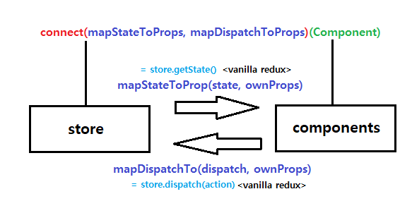

# React Redux Tutorials

> 리덕스를 리액트에서 어떻게 적용하여 사용하는지에 대해서 알아보자

> 리액트 리덕스를 이용한 간단한 CRUD 게시판 만들기

> feat. [생활코딩 ReactRedux](https://opentutorials.org/module/4518) / [ReactRedux Workshop](https://www.youtube.com/watch?v=Cwwsv_OaWhM)

- 생활코딩에서의 실습에 대한 기록을 넘어서 최근 리덕스의 패턴으로 업데이트 하는 과정을 통해서 리덕스의 변화를 경험하려 노력하였다.

## Redux Pattern

- ducks

- container-presenter

## Redux를 React에 적용하는 방법

> react-redux의 flow에 대한 다이어그램

## React-Redux에 새로운 Hooks(?) 적용하기
